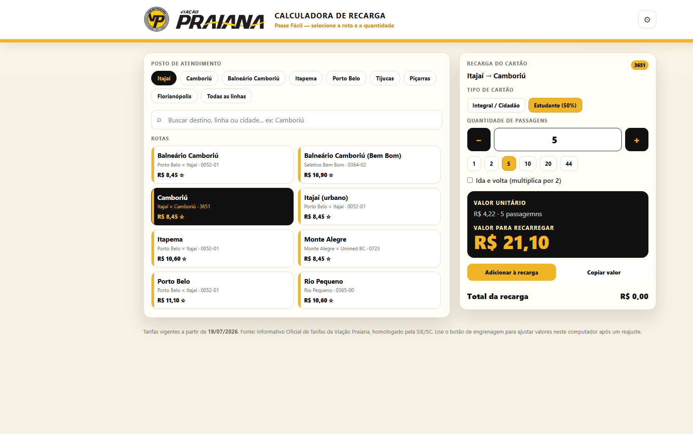
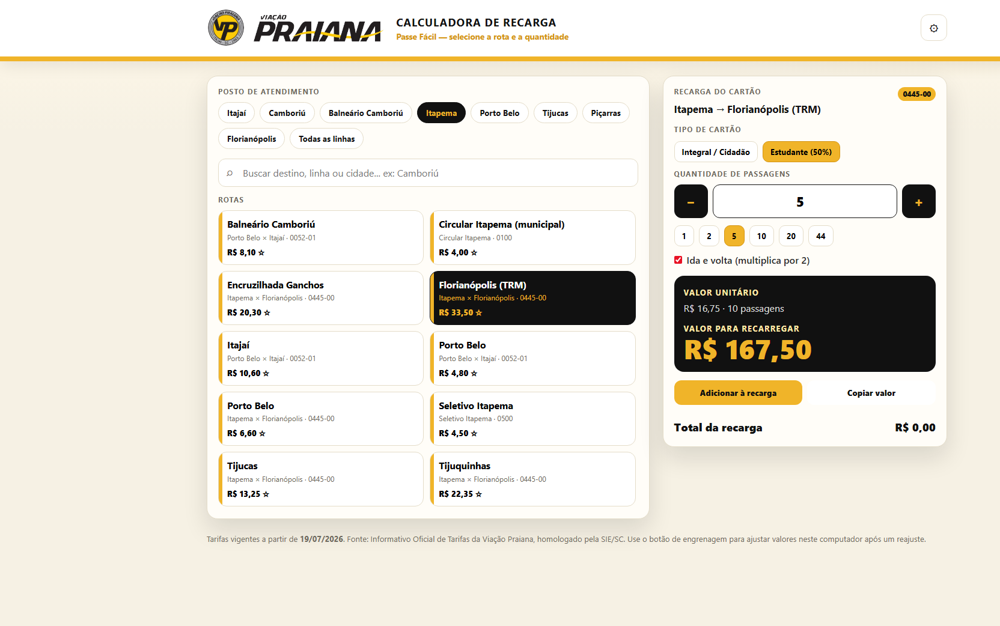
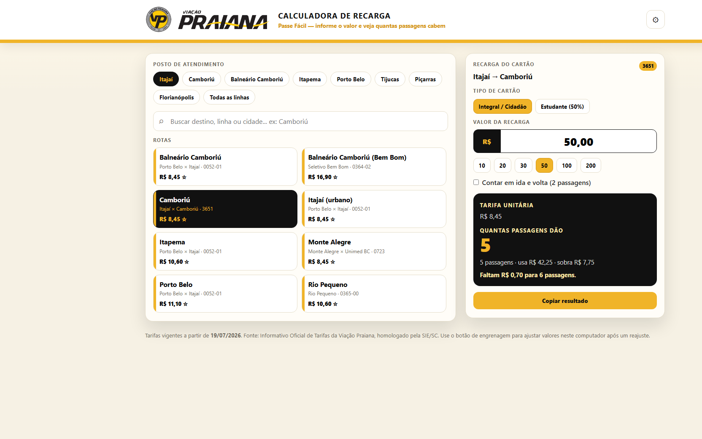

# Calculadora de Recarga — Viação Praiana

# Calculadora de Recarga — Viação Praiana

Pequena aplicação web usada internamente pelos guichês da Viação Praiana para calcular rapidamente quantas passagens cabem em um determinado valor de recarga do cartão "Passe Fácil".

- Host: GitHub Pages — https://jbr121.github.io/contador-de-passagem/
- Vigência das tarifas: 19/07/2026 (Informativo Oficial — SIE/SC)

## Resumo
O atendente informa o valor que o cliente quer recarregar (ex.: R$ 50,00) e o sistema mostra:
- Quantas passagens cabem na rota selecionada (considerando meia-estudante e ida/volta quando aplicáveis)  
- Quanto do valor será consumido por essas passagens  
- Quanto sobra e quanto falta para a próxima passagem

O sistema também permite marcar rotas favoritas, ajustar tarifas localmente no guichê e alternar tipos de cartão.

## Por que este projeto é relevante para portfólio
- Projeto em produção e usado por operação real — demonstra entrega de valor imediato.  
- Interface focada no fluxo do usuário do guichê (rápida e sem dependências externas).  
- Implementação leve (HTML/CSS/JS puro) e hospedagem contínua via GitHub Pages.  

## Screenshots
Calculadora — visão do guichê:

Fluxo de recarga — detalhe da operação:

Valor → Passagens — exemplo de R$ 50,00:

## Como rodar localmente
1. Clone o repositório: `git clone https://github.com/jbr121/contador-de-passagem.git`  
2. Abra `index.html` no navegador ou rode um servidor estático na pasta (ex.: `python -m http.server 8080`).  

## Próximos passos sugeridos
- Adicionar métricas de uso/telemetria (opcional, para relatório de impacto).  
- Melhorar validação de inputs e acessibilidade (WCAG).  
- Implementar backend centralizado para sincronização de overrides entre agências (se for necessário).

---  
Desenvolvido para Viação Praiana — entregue e em uso (2026).  
